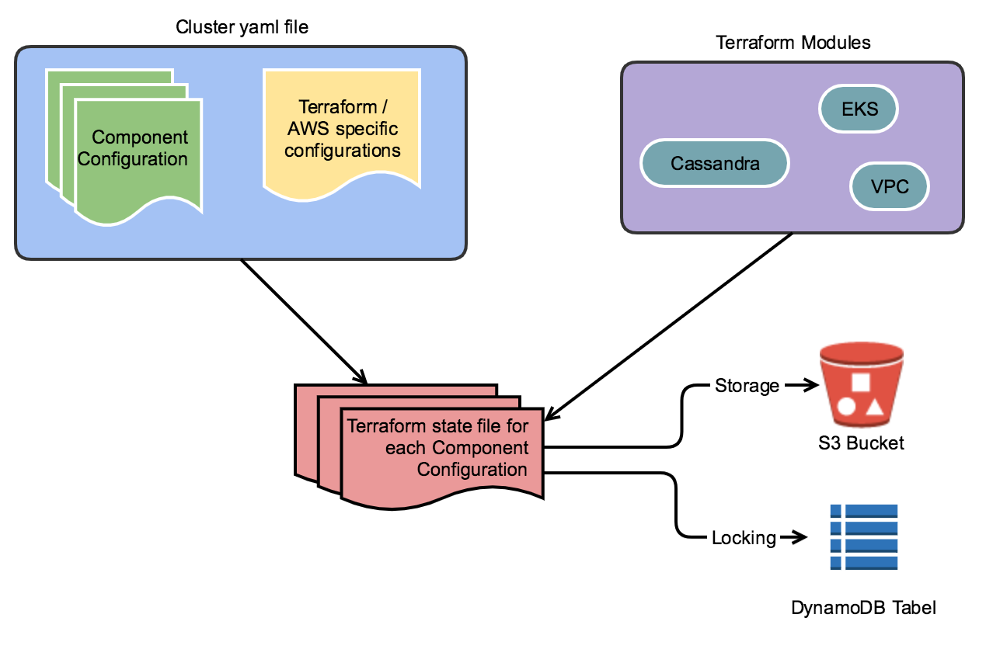

### Obie - Infrastructure as code

Obie is a tool written in Python and is using terraform to manage AWS resources.
It organises the terraform code in form of a cluster.



## Definitions:

**Cluster** - an abstraction layer which includes multiple configurations

**Configuration** - represents a separation of terraform state files and is using terraform modules to manage AWS resources.

**Terraform State File** - Terraform will store the state of AWS managed resource in a file.

**Terraform module** - Modules are used in Terraform to encapsulate groups of AWS resources.  

## Requirements

* Python 3.6 or higher
* A dedicated python virtual environment to install obie. Documentation about how to create a virtual environment can be found here: https://python-guide-cn.readthedocs.io/en/latest/dev/virtualenvs.html
* An AWS profile to allow access to AWS APIs. When running from AWS an IAM Role will be used to get access.

## Obie specifications and features

* Each configuration specified in the cluster conf file will be treated as a separate group of resources and implicitly as separate terraform state files. See below examples of configurations.
* Terraform state files will be stored in an S3 Bucket and tfstate locking will be accomplished using DynamoDB.

###### Obie Configuration file

Obie has a configuration file located at **${OBIE_HOME}/.obie/config.yaml**

Supported parameters:
* *s3_backend_prefix* - this parameter is mandatory and it will be used to configure terraform backend to use S3 and DynamoDB.

###### S3 Bucket / DynamoDB Table name convention
The S3 Bucket where the state file will be stored will have the following naming convention:

```
[prefix]obie-remote-tfstate-[AWS_ACCOUNT_ID]
```

* [prefix] this is mandatory and can be set in obie configuration file.
* [AWS_ACCOUNT_ID] this is mandatory and will be specified in the cluster conf file. 

For DynamoDB table the same naming convention is used as for S3 Bucket.


## Installation
1. Create a new Python virtual env called `obie` and enable it.
2. git clone repo
3. Run `python setup.py install` from inside the directory where you cloned the repository. If you want to install Obie in development mode just run `python setup.py develop`
4. Create a directory where you will define and manage your AWS infrastructure. This is the directory that will be used to set OBIE_HOME environment variable. This should be outside of the directory where you cloned Obie.
5. Create an OS environment variable called `OBIE_HOME` and set it to absolute path of the directory created at previous step. You can add this env var to your profile.d to be automatically loaded at boot.

## How to create a new cluster

1. Go to `OBIE_HOME` and create a directory called `clusters`.
2. Inside `clusters` directory create your obie cluster (e.g. `mycluster`). For this just create a new directory called mycluster. Directory name represents the cluster name. 
3. At this step you should have the following structure: `${OBIE_HOME}/clusters/mycluster`.
4. Create a new configuration file for your cluster called config.yaml, e.g. `${OBIE_HOME}/clusters/mycluster/config.yaml`. This file will contain input data for your terraform code.

###### Example of directory structure for `mycluster`

Let's say OBIE_HOME=/home/user/aws_infra
```
/home/user/aws_infra
                   |
                   |__ .obie/
                   |       |
                   |       |__ config.yaml
                   |
                   |__ clusters/
                              |
                              |__ mycluster/
                              |           |
                              |           |__ config.yaml
                              |
                              |__ cluster2/
                                         |
                                         |__ config.yaml                            

```

As noted there is a configuration file for obie and a configuration file for each cluster.

## Example of cluster configuration file

```yaml
terraform_vars:
  aws_region: 'us-east-1'
  aws_profile: 'tt-dev'
  workspace: 'dev'

configurations:
  vpc:
    cidr: "10.101.0.0/19"
    generic_pub_subnet: "10.101.0.0/24:1" # For this subnet use the second AZ.
    generic_priv_subnet: "10.101.1.0/24"
    tags:
      k1: 'v1'
      k2: 'v2'
      Name: 'obie_vpc'
```

In the above example we can see we have two main categories `terraform_vars` and `configurations`. As stated earlier each configuration will have its own terraform state file. In our example we are defining a single configuration called `vpc`

At this moment obie has the possibility to `show` and `write` the configuration for your cluster.

Example of commands:

`obie mycluster config show` -> this will print on stdout your configuration

`obie mycluster config write` -> this will write the configuration for your cluster. The configuration will be in the form of [tfvars](https://learn.hashicorp.com/terraform/getting-started/variables.html#from-a-file). After running this command your cluster will be populated with multiple files. Check your cluster location.

When running the `write` command a directory will be created for each cluster configuration. In our example we a single configuration called vpc and after running the `write` command the following directory will be created `${OBIE_HOME}/clusters/mycluster/vpc`. In side this rectory you'll see the data exported from your cluster config in format of tfvars.

After writing cluster data using the above command you can go in each of your cluster configuration and run commands like `terraform [init|plan|apply] -var-file=<path-to-global-vars>`. This step will be automated in next obie releases.
